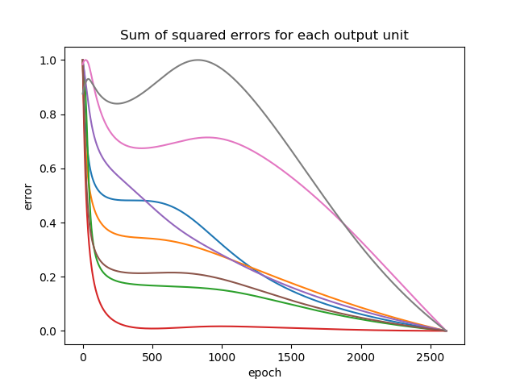

# machine-learning-neural-net-hidden-layer-representation
Recreates the hidden layer representation experiment in Tom Mitchell's "Machine Learning" book

One can use this repo to experiment with the fundamentals of neural networks. Specifically, this code recreates the neural network hidden layer representation experiment from Tom Mitchell’s “Machine Learning” book. The 8x3x8 neural network learns how to binary encode 8 samples. The 8 samples represent numbers 0 through 7.  The backprop algorithm and cost functions derivations are implemented in the code and map nicely to table 4.2 in Mitchell’s book. It is easy to debug the program and view weights and activations. I referenced this [tutorial](http://neuralnetworksanddeeplearning.com/) for creating the learner.

### Hidden Layer Activations
```
011      [0.05100341],   [0.90693915],   [0.72680401]:   Target: 0
111      [0.94697019],   [0.7960775],    [0.94243658]:   Target: 1
001      [0.07578823],   [0.04825404],   [0.88831172]:   Target: 2
010      [0.44213674],   [0.33564178],   [0.22152375]:   Target: 3
000      [0.06863949],   [0.09989021],   [0.0348595]:    Target: 4
110      [0.71912937],   [0.95297097],   [0.11132769]:   Target: 5
101      [0.79973182],   [0.05522087],   [0.81193036]:   Target: 6
100      [0.93140708],   [0.18992512],   [0.07570703]:   Target: 7

```
### Plot


### Dependencies
1. python 2.7
2. numpy
3. pandas
4. matplotlib
5. random
